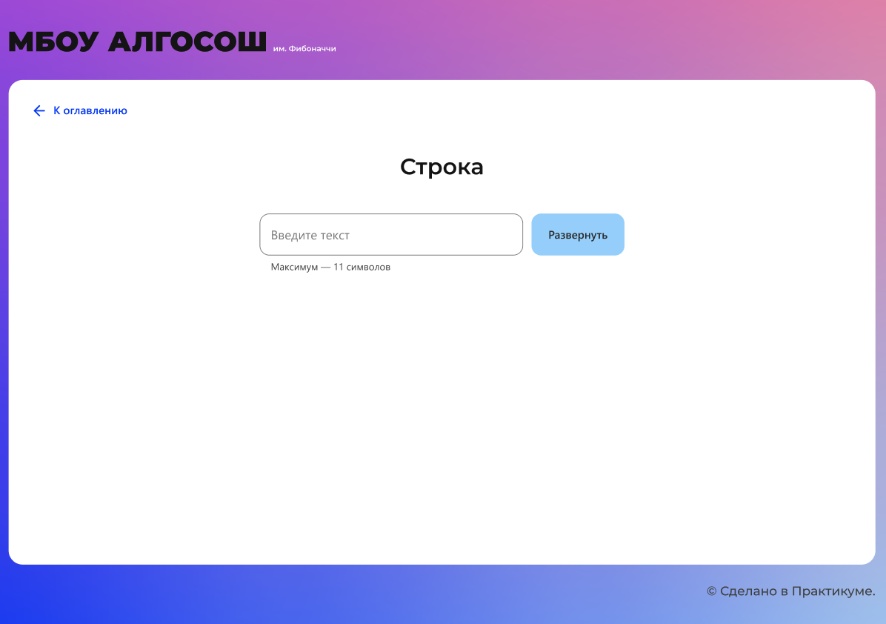

# Проектная работа. МБОУ АЛГОСОШ им. Фибоначчи

В проектной работе мы предлагаем вам написать визуализатор алгоритмов, которые вы будете изучать в течение месяца. Эта проектная работа заточена на анимацию и поэтапное отображение работы алгоритма, что позволит вам детальнее понять каждый шаг его работы.

Мы подготовили [дизайн проекта.](https://www.figma.com/file/RIkypcTQN5d37g7RRTFid0/Algososh_external_link?node-id=0%3A1) Там вы сможете найти необходимые цвета, размеры и примерную раскадровку визуализации, но сначала изучите описание работы.

В репозитории есть заготовка проекта на React. Если его запустить, то вы увидите разводящую страницу и отдельные страницы для визуализации алгоритмов, так что беспокоиться о роутинге не надо. В папке ui вы найдёте готовые компоненты, которые пригодятся вам в работе. Вам предстоит сосредоточиться на алгоритмах и анимациях. 

В качестве примера вы можете подглядеть работу подобных сервисов по визуализации, например, [visualgo.net](https://visualgo.net/en), или полностью самостоятельно разобраться в задаче. Дерзайте!

## Строка

На этом экране вам предстоит развернуть строку. Алгоритм для этого выберите сами.

**Компоненты**

Перед тем как приступить к визуализации, на страницу надо добавить основные компоненты:

- инпут для ввода исходного текста для разворота;
- кнопку «Развернуть».



Начальное состояние страницы

Введите текст в инпут и нажмите развернуть. 

**Визуализация**

Сначала на экране должно появиться слово, буквы которого записаны в синие кружки. Используйте компонент Circle.


Строка в исходном виде

Двух кандидатов на сортировку подсветите цветом `#D252E1`. Уже отсортированные элементы выделите `#7FE051`. 

На скриншоте показана строка, в которой поменяли местами крайние символы:


Промежуточный этап разворота строки

Повторяйте выделение, пока полностью не развернёте строку.

Не забудьте добавить на кнопку лоадер, чтобы избежать прерывания запущенной анимации.

Анимация должна выполняться плавно. Для установки интервала можно использовать значение 1000 мс.

## Последовательность Фибоначчи

На этом экране вам предстоит сгенерировать `n` чисел последовательности Фибоначчи. 
**Компоненты**

Перед тем как приступить к визуализации, на страницу надо добавить основные компоненты:

- инпут для ввода целого числа `n`;
- кнопку «Рассчитать», по клику на неё на экране должна отобразиться последовательность Фибоначчи до числа `n`.


Начальное состояние страницы

Например, вы ввели 4, тогда на экране должен появиться ряд 1, 1, 2, 3, 5. Не забудьте ограничить ввод, в инпут можно вводить только положительные целые числа. И так как последовательность бесконечна, следует добавить максимальную границу ввода 1 ≤ `n`≤ 19.

**Визуализация**

Элементы должны отображаться постепенно. Сначала появляется один, потом второй, третий и так до `n`. Пока ряд появился не полностью, добавьте лоадер на кнопку, чтобы избежать повторных кликов.


Сгенерированная последовательность

Анимация должна выполняться плавно. Для установки интервала можно использовать значение 500 мс.

---

## Сортировка массива

На этом экране вам предстоит визуализировать алгоритмы сортировки выбором и пузырьком

**Компоненты**

Перед тем как приступить к визуализации, на страницу надо добавить основные компоненты:

- RadioInput для выбора способа сортировки (выбором и пузырьком). По умолчанию стоит значение «Выбор».
- Кнопка «По убыванию», по клику на неё элементы массива должны отсортироваться по убыванию, алгоритм сортировки выбираем тот, который указан в RadioInput.
- Кнопка «По возрастанию», по клику на неё элементы массива должны отсортироваться по возрастанию, алгоритм сортировки выбираем тот, который указан в RadioInput.
- Кнопка «Новый массив», по клику на неё функция `randomArr` должна генерировать новый массив.

Помимо компонентов управления, на странице должны отображаться элементы массива.


Начальное состояние страницы

Чтобы задать массив случайных чисел, необходимо написать функцию `randomArr`. При написании учтите, что:

- массив должен состоять из целых чисел $[0; 100]$,
- минимальное количество элементов массива `minLen = 3`, максимальное `maxLen = 17`.

Теперь сгенерированный массив необходимо отобразить на странице. Максимальное значение элемента массива равно 100, это же значение является процентным соотношением высоты столбца. В качестве максимальной высоты считайте 340px.

```tsx
// сгенерированный массив
const arr = [25, 50, 100];
// высоты элементов массива
// `${(340 * arr[i]) / 100}px`
['85px', '170px', '340px']
```

**Визуализация**

Когда вы нажмёте «По убыванию» или «По возрастанию», должен запуститься процесс сортировки в зависимости от выбранного способа: выбором или пузырьком.

Для анимации сортировки добавим два цвета:

- `#D252E1` — элементы, которые сортируем;
- `#7FE051` — отсортированные элементы массива.

Приведём пример сортировки выбором по возрастанию для массива `[2, 34, 17, 100, 50]`. Чтобы отсортировать элементы выбором, сначала надо найти минимальный элемент, поставить первым элементом в массив и так далее:

1. Два сравниваемых числа — 34 и 2 — нужно выделять цветом `#D252E1`.
2. Так как 2 меньше 34, с 34 удаляем выделение цветом, 2 остаётся выделен `#D252E1`;
3. Ищем, есть ли в массиве элемент меньше двойки. Претендентов на минимальный элемент по очереди выделяем цветом `#D252E1`. 
4. Так как 2 — минимальный элемент, меняем его местами с элементом 34 и выделяем цветом `#7FE051`.
5. Смещаемся на один индекс и продолжаем сортировку.

Не забудьте про ограничения. Добавляйте лоадер на активную кнопку и дизейблите все остальные контролы, пока идёт анимация сортировки.

Сортировка массива должна выполняться плавно. Для установки интервала можно использовать значение 1000 мс.

---

## Стек

На этом экране вам предстоит визуализировать удаление и добавление элементов в структуру данных стек

**Компоненты**

Перед тем как приступить к визуализации работы со стеком, на страницу надо добавить основные компоненты:

- Инпут для ввода значений, которые будут добавляться в стек. Вы можете использовать дженерик, чтобы задать обобщённый тип значений.
- Кнопкa «Добавить», по клику на неё должен вызываться метод стека `push(item)`.
- Кнопкa «Удалить», по клику на неё должен вызываться метод стека `pop()`.
- Кнопка «Очистить», чтобы по клику на неё сразу удалить все элементы из стека.

Больше на странице ничего не должно быть, так как наш стек ещё пуст.


Начальное состояние страницы

**Визуализация добавления** 

Если ввести в инпут значение и нажать «Добавить», в стеке должен появиться первый элемент, который необходимо отрисовать на странице.

Для отображения элементов стека используйте компонент Circle. Внутри должно быть записано введённое значение, сверху компонента — указатель на вершину стека `top`, а снизу — номер индекса элемента (для первого элемента — `0` и так далее).

Инпут необходимо очистить после добавления элемента в стек. 

При добавлении ещё одного элемента справа от предыдущего должен появиться Circle с новым значением и индексом 1. И теперь уже над ним должна оказаться подпись `top`. В момент добавления на долю секунды подсветите новый элемент цветом `#D252E1`.

Если в инпуте нет числа, по клику на кнопку «Добавить» метод `push(item)` не вызывается.

**Визуализация удаления**

Если нажать «Удалить», из стека должен извлекаться только верхний элемент. Удаляемый элемент выделяется цветом, надпись `top` перемещается на его левого соседа. 

Если в стеке всего один элемент, то после нажатия «Удалить» на странице не отображаются никакие элементы стека. 

По клику на кнопку «Очистить» из стека удаляются все элементы сразу.

Не забудьте про ограничения. Например, при нажатии на кнопку отображайте на ней лоадер, а остальные контролы дизейблите. Ограничьте ввод значения до четырёх символов, иначе значение будет странно смотреться в компоненте Circle.

Все анимации на странице должны выполняться плавно. Для установки интервала можно использовать значение 500 мс.

---

## Очередь

На этом экране вам предстоит визуализировать удаление и добавление элементов в структуру данных «очередь».

**Компоненты**

Перед тем как приступить к визуализации работы с очередью, на страницу надо добавить основные компоненты:

- инпут для ввода значений, которые будут добавляться в очередь;
- кнопкa «Добавить», по клику на неё должен вызываться метод очереди `enqueue(item)`;
- кнопкa «Удалить», по клику на неё должен вызываться метод очереди `dequeue()`;
- кнопка «Очистить», чтобы по клику на неё сразу удалить все элементы из очереди;
- отобразите пустые элементы очереди c помощью компонента Circle;
- добавьте кнопку «Очистить», чтобы по клику на неё сразу удалить все элементы из очереди.


Начальное состояние страницы

**Визуализация**

Если ввести в инпут значение 2 и нажать «Добавить», элемент должен отобразиться под индексом 0. Также добавьте на элемент указатели `head` и `tail`. Инпут при этом очищается.


Очередь с одним элементом

При добавлении элементов в очередь позиция tail должна смещаться, на долю секунды выделяйте новый элемент цветом `#D252E1`.


Очередь из трёх элементов в момент добавления

Потом уберите выделение и очистите инпут.

Теперь если нажать «Удалить», из очереди должен извлечься элемент под индексом 0 (на долю секунды подсветите элемент `#D252E1`), a `head` будет перемещён на элемент с индексом 1.


Очередь после `dequeue();`

Все анимации на странице должны выполняться плавно. Для установки интервала можно использовать значение 500 мс.

Не забудьте про ограничения. Например, при нажатии на кнопку отображайте на ней лоадер, а остальные контролы дизейблите. Ограничьте ввод значения до четырёх символов, иначе значение будет странно смотреться в компоненте Сircle.

---

## Связный список

На этом экране необходимо реализовать удаление и добавлениеэлементов в связный список. 

**Компоненты**

Перед тем как приступить к визуализации работы с очередью, на страницу надо добавить основные компоненты.

Для добавления элемента:

- инпут с плейсхолдером «Введите значение» для ввода значения `value`, которое будете добавлять в список;
- кнопка «Добавить в head», по клику на которую значение из инпута должно стать новой головой списка, инпут при этом очищаем;
- кнопка «Добавить в tail», по клику на которую значение из инпута должно стать новым хвостом списка, инпут при этом очищаем.

Для удаления элемента:

- кнопка «Удалить из head», по клику на которую удаляется первый элемент из списка;
- кнопка «Удалить из tail», по клику на которую удаляется последний элемент из списка.

Для удаления или добавления по индексу:

- инпут с плейсхолдером «Введите индекс» для ввода индекса `ind` элемента связного списка;
- кнопка «Добавить по индексу», по клику на которую значение из инпута `value` должно занять в списке место под номером `ind`, инпут с `value` при этом очищаем;
- кнопка «Удалить по индексу», по клику на которую удаляется `ind`-элемент из списка.

Кроме элементов управления, на странице должен отображаться небольшой связный список, например `0 → 34 → 8 → 1`.


Начальное состояние страницы

### Визуализация

**При добавлении в head** элемент должен появиться над первым элементом вместо надписи head.


Добавление в head

Затем он занимает первое место в списке и на долю секунды выделяется зелёным цветом. Теперь над новым элементом написано head, и он указывает на предыдущий head-элемент.


Отображение нового элемента в head

**При добавлении в tail** элемент должен появиться в хвосте над элементом с надписью tail. Затем он занимает последнее место в списке и на долю секунды выделяется зелёным цветом. Теперь под новым элементом написано tail.

**При добавлении элемента по индексу** должны быть заполнены два поля: «Введите значение» и «Введите индекс». Помните, что вся анимация выполняется поэтапно: 

- По клику на «Добавить по индексу» новый элемент должен отобразиться над первым элементом.
- Пока ищем нужный индекс, поочерёдно подсвечиваем элементы. Добавляемый элемент перепрыгивает по списку до искомого индекса.
- Когда индекс найден, отображаем новый элемент над ним и добавляем.

В этом примере число 10 должно занимать индекс 2.


Добавление по индексу. Поиск индекса

После успешного добавления 10 стоит под порядковым номером 2 и указывает на 34. Новый добавленный элемент выделите цветом. Через долю секунды уберите все цветовые выделения и лоадер на кнопке — вставка завершена.


Добавление по индексу. Новый элемент в списке

**При удалении элемента по индексу** сначала необходимо выделять цветом элементы, пока не достигнем нужного индекса. Затем очистить значение в элементе и снизу отобразить маленький кружок с удаляемым значением.

Например, вы ввели индекс 2 и нажали «Удалить по индексу». Сначала цветом выделяется элемент с индексом 0, потом с индексом 1, и когда мы дошли до нужного индекса, то удаляем элемент из связного списка:


Удаление элемента под индексом 2

**При удалении элемента из tail** кружок замещает надпись tail.


Удаление элемента из tail

Обратите внимание, что при добавлении новый элемент следует отображать над элементами списка, а при удалении — под ними.

Все анимации на странице должны выполняться плавно. Для установки интервала можно использовать значение 500 мс.

Не забудьте про ограничения. Добавляйте лоадер на активную кнопку и дизейблите все остальные контролы. Ограничьте ввод значения до четырёх символов, иначе значение будет странно смотреться в компоненте Circle.

## Отправка работы на проверку

Когда будете готовы показать код-ревьюеру финальный результат, отправьте ссылку на пул-реквест, открытый из ветки `month-12/step-1`, в `main` через интерфейс Практикума. Отправить ссылку можно в отдельном уроке, который доступен [по ссылке](https://praktikum.yandex.ru/trainer/web-plus/lesson/a2bd2943-6f29-43df-a749-c4cb88f6301b/). В этом уроке находится интерфейс финальной сдачи проектной работы.
